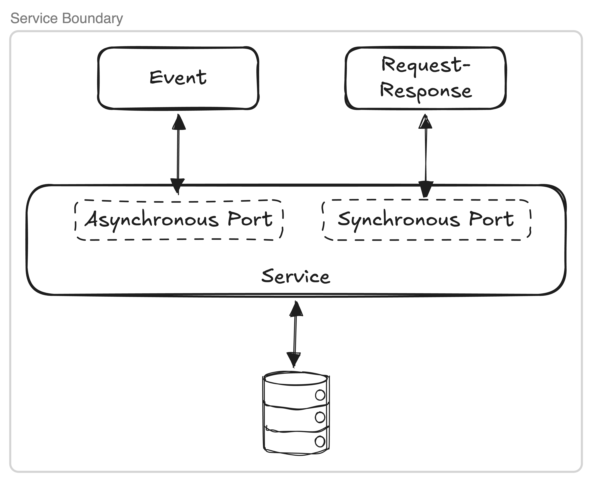

You would never expose a REST API without an API gateway in front of it. Authentication, rate limiting, observability, access control — these aren't optional extras, they are mandatory and we've spent the last decade building the API gateway pattern to solve exactly this problem.

So here's the question worth sitting with: **would you expose an event stream without a gateway?**

---

## First, what is an event?

Before we talk about an event gateway, it's worth grounding ourselves on what an event is.

> An event is simply a record of something that happened.

In modern integration, there are two main ways to connect systems.

1. **A synchronous request-response port** — an application asks for information, makes a request, and waits for an answer. A large portion of the internet works this way, whether it's REST, GraphQL, or MCP tool calls.

1. **An asynchronous event port** — an application produces or consumes events. A user logging in. A product added to a cart. A sensor reading from a factory floor. Events are the things accumulating in your system over time.

The tool most commonly used to store and serve these events is Apache Kafka. Its core data structure is simple: an append-only log. You never overwrite data — you just keep accumulating what happened, so any number of services can consume and react to it.

For years, we've treated the synchronous port as the primary external integration port and the asynchronous port as an internal implementation detail — something that moves data between your own services, not something you safely expose to the outside world. That assumption is starting to change.

---

## The birthday party

My daughter recently turned one. If you've ever organised a first birthday party, you quickly realise it's somehow more stressful than organising a wedding. There are invitations, a venue, RSVPs, a cake, food, invoices, weather monitoring, and guest notifications to name a few. One of the very first things I had to do was invite all her friends. So I had two options:

- **Option 1 — synchronous:** We can call every friend individually. I pick up the phone, wait for them to answer, invite them, and receive their RSVP. You get an immediate, confirmed answer. But everyone has to be available at the exact moment you're calling, and if your daughter has as many friends as mine does, you'll be on the phone for days.

- **Option 2 — asynchronous:** We can post a message in a group chat. We announce the date and venue once, and let people respond in their own time. Some people may RSVP within minutes. Someone else may come back three days later. The information is there when they're ready for it.

So which option do you choose? It depends — and that's exactly the point. The right approach is always dependent on the context. The problem is that most systems have defaulted to synchronous even when asynchronous may be a better fit.

---

## Reactive AI agents demand events

We already expect the systems we use every day to be reactive. When you book a venue, a confirmation email arrives immediately. When you pay an invoice, the transaction appears in your bank account within seconds. These experiences are all driven by events that are happening in the system. They are event-driven.

And the expectation of reactive systems is only growing — especially as our industry shifts from deterministic applications to AI agents. Agents can't sit there polling for updates every minute or wake up at 1am to run a batch job. Just as humans are constantly listening and reacting to our environment, agents need to do the same. We can think of a reactive AI agent as having three parts:

- **The language model as the brain.** It reasons, plans, and decides what to do next.
- **Events as the ears.** They let the agent hear what's happening without constantly having to ask.
- **Tools as the hands.** They let the agent reach out and take action — booking a venue, updating a database, sending a notification.

Most of the AI conversation right now is about the brain (which model, which prompt) and the hands (which MCP servers, which tools). The ears deserve more attention.

Let's assume I want to build an AI agent to help plan the birthday party. I could give it a large set of MCP tools to handle all the actions. But some of the things it needs to respond to aren't things it can ask for — they just happen. For example:

- A guest submits an RSVP via a form
- The weekend weather forecast changes dramatically
- A supplier sends a delivery update

These aren't things you want to pull with an MCP tool call on a schedule. They're events. And this is where a clear pattern is emerging:

> **Events trigger AI agents. MCP executes.**

---

## Event gateways are the natural evolution

Here's the reality: just as everyone wants access to your REST APIs, everyone also wants access to your events. And the demand for your events will grow significantly as AI agents start listening to events. AI agents will need to consume your events. Frontend applications need to reflect live state. Analytics teams want event feeds piped directly into their platforms. The problem is that exposing Kafka to the outside world is not straightforward.

There are four issues to consider. The first matters when Kafka is exposed externally. The other three apply whenever Kafka is exposed, whether internally, externally, or both.

**1. External consumers should never see your internals.**

Kafka's connection model requires clients to know about brokers. In a managed cluster, your bootstrap servers are internal addresses — they reflect your topology, your naming conventions, your cloud region layout. The moment you hand those out externally, you've leaked your infrastructure as a public contract. Migrate clusters, rebalance brokers, or switch cloud providers, and every external consumer breaks.

An event gateway gives you a single, stable entry point. One address. One connection surface so your back-end infrastructure can change without your consumers ever knowing.

**2. You have more than one Kafka cluster.**

Most organisations running Kafka at scale don't have just one cluster. They have a cluster per environment, a cluster per business domain, clusters from acquisitions that haven't been consolidated, managed Kafka from three different vendors because different teams made different choices at different times. A DR cluster sitting in the corner.

None of that should be visible to external consumers. A partner consuming your order events shouldn't need to know that orders live on a different cluster than your inventory events. Without a gateway, you're forcing external consumers to manage multiple connections, multiple credentials, and multiple bootstrap configurations — and you're exposing your internal domain boundaries as a side effect. A single governance plane in front of all your clusters solves this, applied once, uniformly, regardless of what's behind it.

**3. You need centralised governance.**

Kafka brokers are intentionally designed to be thin. An event gateway is that centralisd enforcement point. Lightweight header and payload transformation, schema validation, caching, encryption, decryption, filtering — applied consistently across every topic, every cluster.

**4. Kafka is one protocol. Your consumers speak many.**

Kafka is a brilliant protocol for high-throughput, durable, ordered event storage. But it's not the only protocol your consumers need. A B2B partner may speak native Kafka. A mobile app displaying a live order status will want a WebSocket connection.

An event gateway decouples the storage protocol from the delivery protocol. Kafka stores and moves your events internally. The gateway translates - serving the same stream over native Kafka to consumers who can handle it, over WebSocket to browser clients, over SSE to simpler HTTP-based integrations. Consumers get the stream in the format that works for them.

It's worth noting, if a consumer _can_ speak Kafka, it _should_. The semantics come for free and the operational surface stays small. WebSocket and SSE are the alternative for the things that genuinely can't - browsers, constrained devices, constrained SaaS applications.

---

## Why event gateways matter

Events are already the connective tissue that choreographs your internal systems. They're increasingly going to be what triggers your AI agents too.

For the last decade, we've focused on making REST APIs available inside and outside our organisations safely and at scale. The natural next step is extending that same gateway pattern to the event layer — because applications don't just need APIs, and AI agents don't just need tools. They need ears.

Ask yourself an honest question: are you polling an endpoint on a timer, waiting to hear if something changed, simply because you couldn't securely expose your Kafka topic? If the answer is yes, you should probably switch that to a stream managed by an event gateway. Polling is a tax you pay on every interval, whether or not anything happened.

>Your REST APIs have a gateway. Your event streams need one too. These aren't two separate platforms for two separate problems — they're one unified connectivity layer that understands both integration ports.
---

*Warren Vella is a Staff Solutions Engineer at Kong, based in Melbourne, Australia. He joined from Confluent, where he spent four years helping teams design and run Apache Kafka and event-driven architectures at scale. This post is adapted from a talk delivered at the Agentic World Tour, Auckland, April 2026.*
